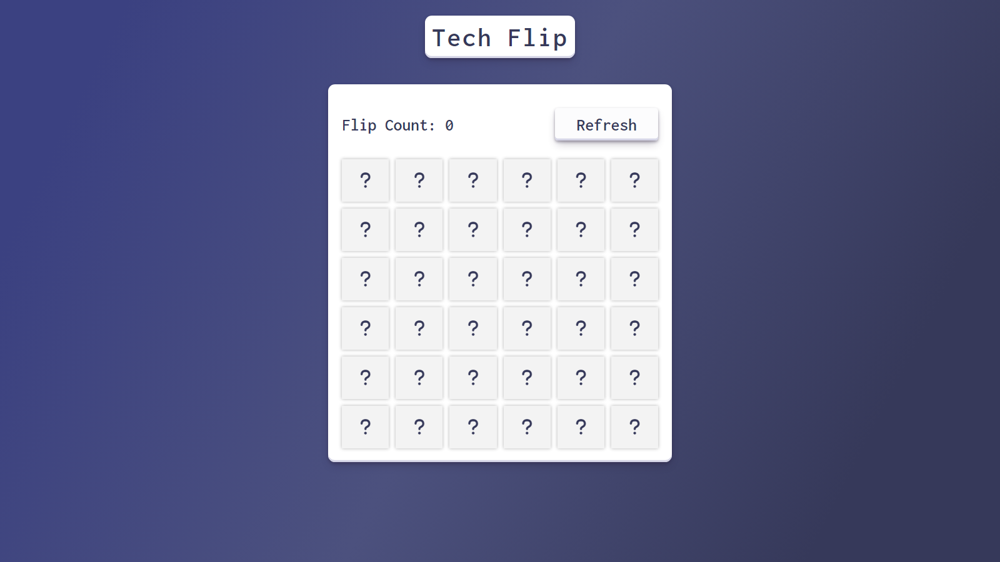

  

---

# Tech Flip

Tech Flip is a memory card flip match game based on the programming language theme. It provides a simple interface where users can test their memory skills by flipping cards and matching pairs.

You can <a href="https://www.youtube.com/watch?v=B-6JigCXSxI" target="_blank">**click here**</a> to see an overview of the page.

## Features

- Memory card game with a programming language theme.
- Flip count tracker to keep track of the number of flips made by the player.
- Reset button to restart the game and reset the flip count.
- Responsive grid layout.
- Interactive card flipping animation.

## Technologies Used

- <a href="https://developer.mozilla.org/en-US/docs/Web/HTML" target="_blank">**HTML**</a>: Markup language for creating web pages.
- <a href="https://developer.mozilla.org/en-US/docs/Web/CSS" target="_blank">**CSS**</a>: Styling language for designing the appearance of web pages.
- <a href="https://developer.mozilla.org/en-US/docs/Web/JavaScript" target="_blank">**JavaScript**</a>: Programming language for adding interactivity and dynamic features to web pages.

## Project Structure

- `assets`: This directory contains any necessary assets such as images or icons used in the project.
- `index.html`: The main HTML file that serves as the entry point of the application.
- `styles.css`: The CSS file that contains the styles for the web page.
- `index.js`: The JavaScript file that handles the logic and functionality of the web page.

## Authors

- Matías Gonta

If you have any questions, concerns or interests, feel free to contact me.

---

  

---

# Tech Flip

Tech Flip es un juego de tarjetas de memoria basado en el tema del lenguaje de programación. Proporciona una interfaz simple donde los usuarios pueden probar sus habilidades de memoria volteando cartas y emparejando pares.

Puedes hacer <a href="https://www.youtube.com/watch?v=B-6JigCXSxI" target="_blank">**clic aquí**</a> para una visión general de la página.

## Características

- Juego de cartas de memoria con una tematica basada en lenguajes de programación.
- Rastreador de conteo de flips para realizar un seguimiento de la cantidad de volteadas realizadas por el jugador.
- Botón para reiniciar el juego y restablecer el conteo de vueltas.
- Diseño responsive con grid.
- Animación interactiva de volteo de cartas.

## Tecnologías utilizadas

- <a href="https://developer.mozilla.org/en-US/docs/Web/HTML" target="_blank">**HTML**</a>: Lenguaje de marcado para la creación de páginas web.
- <a href="https://developer.mozilla.org/en-US/docs/Web/CSS" target="_blank">**CSS**</a>: Lenguaje de estilo para diseñar la apariencia de paginas web.
- <a href="https://developer.mozilla.org/en-US/docs/Web/JavaScript" target="_blank">**JavaScript**</a>: Lenguaje de programación para agregar interactividad y características dinámicas a las páginas web.

## Estructura del proyecto

- `assets`: Este directorio contiene todos los activos necesarios, como imágenes o iconos utilizados en el proyecto.
- `index.html`: El archivo HTML principal que sirve como punto de entrada de la aplicación.
- `styles.css`: El archivo CSS que contiene los estilos para la página web.
- `index.js`: El archivo JavaScript que maneja la lógica y la funcionalidad de la página web.

## Autores

-Matias Gonta

Si tiene alguna pregunta, inquietud o interes, no dude en ponerse en contacto conmigo.